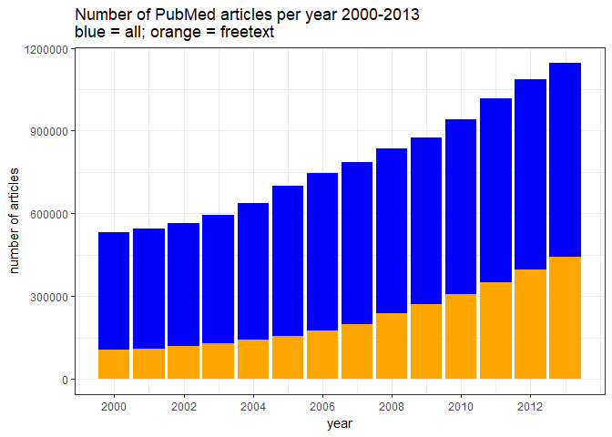
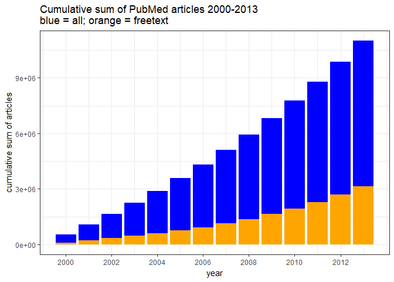
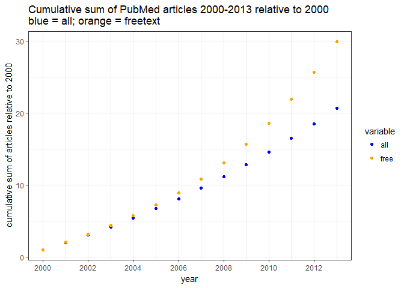
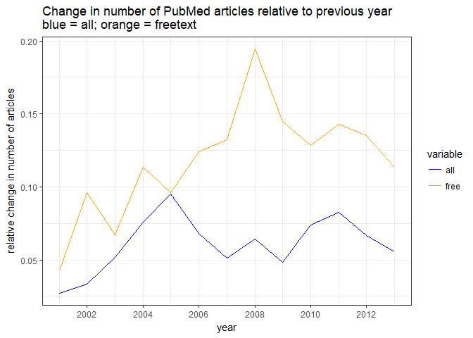

Growth in free and closed scientific publications 2000-2013
================
Neil Saunders
28/11/2014

-   [Introduction](#introduction)
-   [Data](#data)
-   [Analysis](#analysis)
    -   [Free full text articles as proportion of all articles](#free-full-text-articles-as-proportion-of-all-articles)
    -   [Cumulative increase in free full text articles as proportion of cumulative increase in all articles](#cumulative-increase-in-free-full-text-articles-as-proportion-of-cumulative-increase-in-all-articles)
    -   [Cumulative increase in articles relative to start year](#cumulative-increase-in-articles-relative-to-start-year)
    -   [Change in number of articles as a proportion of previous year](#change-in-number-of-articles-as-a-proportion-of-previous-year)
-   [Conclusions](#conclusions)

Introduction
============

This document is in response to [Contrary to what you read in Nature, Open Access has not caused the growth in science publishing](http://www.michaeleisen.org/blog/?p=1654).

**Note:** I made an error in this analysis by assuming that the PubMed "freetext" filter was a good approximation for open-access. This is not the case; I should have used the OA subset of PubMed Central and did so in a second report, also available here.

Data
====

We search PubMed between the years 2000-2013 as follows:

-   Total number of articles published in a year using the PDAT (date of publication) qualifier *e.g.* "2000\[PDAT\]"
-   Filter by "free full text available"" using the filter "freetext\[FILT\]"

Note that other filters are available: "free not pmc" and "free only pmc". However, "freetext" would seem to be the most appropriate to capture all "freely-available" articles.

``` r
library(rentrez)
library(ggplot2)
library(reshape2)
```

``` r
e.test <- data.frame(year = 2000, free.only.pmc = entrez_search("pubmed", "2000[PDAT] AND free+only+pmc[FILT]")$count, 
    free.not.pmc = entrez_search("pubmed", "2000[PDAT] AND free+not+pmc[FILT]")$count, 
    freetext = entrez_search("pubmed", "2000[PDAT] AND freetext[FILT]")$count)
e.test
```

    ##   year free.only.pmc free.not.pmc freetext
    ## 1 2000          7680        66443   104624

``` r
# create list to hold data
d <- data.frame(year = NA, all = NA, free = NA)
# count total and free articles for 2000-2013
for(i in 1:14) {
    e.all  <- entrez_search("pubmed", paste(i+1999, "[PDAT]", sep = ""))
    e.free <- entrez_search("pubmed", paste(i+1999, "[PDAT] AND freetext[FILT]", sep = ""))
    d[i, "year"] <- i+1999
    d[i, "all"]  <- e.all$count
    d[i, "free"] <- e.free$count
}
```

Now we calculate the proportion of free full text articles and the cumulative sum (year on year increase) of both all and free full text articles.

``` r
d$prop    <- d$free / d$all
d$all.cs  <- cumsum(d$all)
d$free.cs <- cumsum(d$free)
d
```

    ##    year     all   free      prop   all.cs free.cs
    ## 1  2000  531684 104624 0.1967785   531684  104624
    ## 2  2001  546105 109094 0.1997674  1077789  213718
    ## 3  2002  564381 119558 0.2118392  1642170  333276
    ## 4  2003  593436 127577 0.2149802  2235606  460853
    ## 5  2004  638450 142078 0.2225358  2874056  602931
    ## 6  2005  699205 155702 0.2226843  3573261  758633
    ## 7  2006  746718 175023 0.2343897  4319979  933656
    ## 8  2007  785067 198160 0.2524116  5105046 1131816
    ## 9  2008  835548 236711 0.2833003  5940594 1368527
    ## 10 2009  875783 271013 0.3094522  6816377 1639540
    ## 11 2010  940492 305874 0.3252276  7756869 1945414
    ## 12 2011 1018291 349610 0.3433301  8775160 2295024
    ## 13 2012 1085936 396841 0.3654368  9861096 2691865
    ## 14 2013 1146110 441956 0.3856139 11007206 3133821

Analysis
========

Free full text articles as proportion of all articles
-----------------------------------------------------

The "freetext" articles rose steadily from around 21% of all articles (2000) to 33% (2013).

``` r
ggplot(d) + geom_bar(aes(year, all), stat = "identity", fill = "blue") + geom_bar(aes(year, 
    free), stat = "identity", fill = "orange") + theme_bw() + ylab("number of articles") + 
    xlab("year") + scale_x_continuous(breaks = seq(2000, 2013, by = 2)) + labs(title = "Number of PubMed articles per year 2000-2013\nblue = all; orange = freetext")
```



Cumulative increase in free full text articles as proportion of cumulative increase in all articles
---------------------------------------------------------------------------------------------------

529 860 PubMed articles were published in 2000. The cumulative sum of all articles published between then and 2013 is 10 934 738.

It is clear from this chart that the yearly increase of freetext articles is much less than that of all articles.

``` r
ggplot(d) + geom_bar(aes(year, all.cs), stat = "identity", fill = "blue") + 
    geom_bar(aes(year, free.cs), stat = "identity", fill = "orange") + theme_bw() + 
    ylab("cumulative sum of articles") + xlab("year") + scale_x_continuous(breaks = seq(2000, 
    2013, by = 2)) + labs(title = "Cumulative sum of PubMed articles 2000-2013\nblue = all; orange = freetext")
```



Cumulative increase in articles relative to start year
------------------------------------------------------

The rate of accumulation of free full text articles compared with the base year of 2000 is somewhat higher than that for all articles.

``` r
d2 <- data.frame(year = 2000:2013, all = d$all.cs/d$all.cs[1], free = d$free.cs/d$free.cs[1])
d2.m <- melt(d2, id.vars = "year")
ggplot(d2.m) + geom_point(aes(year, value, color = variable)) + theme_bw() + 
    scale_color_manual(values = c("blue", "orange")) + scale_x_continuous(breaks = seq(2000, 
    2013, by = 2)) + ylab("cumulative sum of articles relative to 2000") + labs(title = "Cumulative sum of PubMed articles 2000-2013 relative to 2000\nblue = all; orange = freetext")
```



Change in number of articles as a proportion of previous year
-------------------------------------------------------------

The year-on-year change in number of articles is not very informative, as there is a lot of unexplained fluctuation.

``` r
d3 <- data.frame(year = NA, all = NA, free = NA)
for (i in 1:13) {
    d3[i, "year"] <- d[i + 1, "year"]
    d3[i, "all"] <- (d[i + 1, "all"] - d[i, "all"])/d[i, "all"]
    d3[i, "free"] <- (d[i + 1, "free"] - d[i, "free"])/d[i, "free"]
}
d3.m <- melt(d3, id.vars = "year")
ggplot(d3.m) + geom_line(aes(year, value, color = variable)) + theme_bw() + 
    scale_color_manual(values = c("blue", "orange")) + scale_x_continuous(breaks = seq(2000, 
    2013, by = 2)) + ylab("relative change in number of articles") + labs(title = "Change in number of PubMed articles relative to previous year\nblue = all; orange = freetext")
```



Conclusions
===========

From 2000-2013:

-   Total and freetext articles in PubMed rose steadily
-   The proportion of freetext articles rose from around 21% to 33%
-   Total articles accumulated at a higher rate than freetext articles
-   From 2005 onwards, freetext articles accumulated at a slightly higher rate than total articles relative to a baseline year of 2000
-   Year-on-year changes in article numbers show no clear pattern
-   ~~Number of articles in PMC is not a good proxy for number of open-access articles~~
